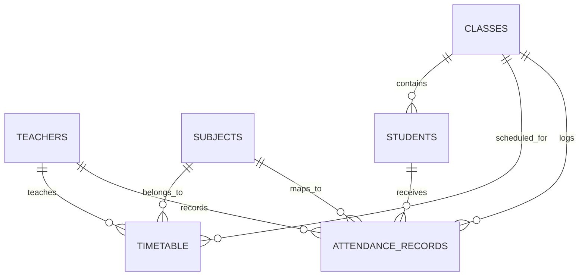

# 📊 Attendance & Academic Management System (AMS)

A premium, highly interactive, and responsive web application designed for modern educational institutions. This system provides a **five-tier architecture** with specialized portals for **Students**, **Teachers**, **Class Coordinators**, **Heads of Departments (HODs)**, and **Administrators**, powered by a high-performance **Supabase** backend and styled with a sleek, modern, navy-themed glassmorphic aesthetic.

---

## ✨ System Portals & Functional Capabilities

### 🎓 1. Student Portal (Zero-Credentials Access)
An instant-access, passwordless dashboard designed to keep students updated on their attendance status in real-time.
* **Instant Verification**: Access via Roll Number, Course, Branch, and Section details.
* **Exam Eligibility Analytics**: Dynamically calculates and tags eligibility based on attendance:
  * 🟢 **Eligible (≥ 75%)** — Meets required course criteria.
  * 🟡 **Borderline (60% - 75%)** — Warning status to boost attendance.
  * 🔴 **Ineligible (< 60%)** — Below minimum required limits.
* **Overall Attendance Gauge**: Interactive, color-coded visual indicator mapping present vs. conducted classes.
* **Subject-Wise Analytics**: Detail-rich cards displaying exact attendance fractions (e.g., `12/15` classes) and interactive progress bars for every subject.
* **Date-Wise Timeline**: Filterable list where students can search by subject or teacher name and toggle views specifically for "Present" or "Absent" days.

### 🏫 2. Teacher Portal (Secure Classroom Marking)
A robust, lightweight tool for educators to log daily attendance and manage schedules.
* **Secure Auth**: Fully verified teacher-only login via Supabase credentials.
* **Interactive Class Registry**: Dynamically load students by filtering **Year**, **Branch**, **Section**, and **Subject**.
* **Micro-Interactive Status Marking**: Single-click toggle buttons (`Present` / `Absent`) with dynamic color response.
* **Submission Summary Card**: Instantly showcases a performance gauge representing the attendance rate for the submitted lecture.
* **Interactive History & Records Modification**: 
  * View all conducted lectures with detailed class attendance rates.
  * Deep-dive into specific session details.
  * Instantly update a student's status for a past class (toggles between Present/Absent) with automatic sync.

### 📋 3. Class Coordinator Portal (Classroom Supervision & Exams)
A specialized workspace for appointed class coordinators to supervise class-wide metrics and manage exams.
* **5-Card Performance Dashboard**: Instantly tracks:
  1. **Total Scheduled Lectures**: Total sessions conducted for the selected class.
  2. **Average Attendance Rate**: Combined class attendance rate.
  3. **Students Below 75%**: Counts students falling below the mandatory attendance limit.
  4. **Pending Submissions**: Lectures with scheduled slots that have not yet had attendance logged.
  5. **Active Mid-Semester Test (MST)**: Showcases details of ongoing MST exam cycles.
* **Trend Selection**: Toggle class statistics across **Daily**, **Weekly**, or **Monthly** intervals.
* **Radial Performance Gauge**: Displays a gorgeous progress gauge tracking attendance averages dynamically based on the selected trend.
* **Subject-Wise Distribution**: Shows comparative attendance rates per subject, with quick alerts for subjects lagging in attendance.
* **Export to CSV**: Download complete attendance reports for offline records with one click.
* **MST Exam Scheduler**: Schedule exams, map subjects, select branches, dates, and view timetables with built-in null-safe safeguards.

### 🏢 4. HOD Portal (Departmental Administration)
An oversight workspace giving Heads of Departments visibility into academic stats across all years and branches of their department.
* **Department Statistics**: Tracks overall departmental attendance averages.
* **Subject-Wise Analytics Grid**: Outlines average performance across all subjects.
* **Class Performance Leaderboard**: View which years and sections are performing best.
* **Student Directory & Risk Tracking**: Instantly view the names and roll numbers of students who are currently borderline or ineligible due to low attendance.

### 🛡️ 5. Admin Portal (Scoped Institutional Management)
An enterprise-grade control panel for system configuration and global database management.
* **Scope Locking**: A clean workspace architecture requiring administrators to pick a **Department** and **Branch** scope. The system filters all dashboards to match the selection, avoiding workspace visual clutter.
* **Teacher Management**: Complete profile management including Employee ID, Department, Class Coordinator privilege checkbox, and **Account Status Activation/Deactivation** toggles.
* **Student Registry**: Manage students and instantly edit their demographic fields (Roll No, Course, Class, etc.).
* **Course & Class Configuration**: Define Subject codes, map Year levels, and configure classrooms.
* **Lecture Scheduler (Timetable)**: A smart scheduling system that links Teachers, Subjects, and Classes. Includes **Auto-Resolution**, meaning that if a teacher or subject name typed by an admin does not exist in the database, the system automatically creates the profile dynamically to save time.
* **System Monitoring**: Live telemetry dashboard tracking daily submissions count and active coordinators.

---

## 🎨 Design System & Aesthetics

Crafted using vanilla **HTML5**, **CSS3**, and **ES6 Javascript** for blazing-fast page loads. No bulky framework overhead.
* **Color Palette (Modern Navy Theme)**:
  * Primary/Brand: Dark Navy Blue (`#003366`)
  * Primary Hover: Deep Navy (`#002244`)
  * Primary Light: Soft Navy Tint (`rgba(0, 51, 102, 0.08)`)
  * Text/Main: Gray 800 (`#1f2937`)
  * Text/Muted: Gray 500 (`#6b7280`)
  * Glassmorphism: Frosted card layouts (`rgba(255, 255, 255, 0.45)`) with subtle borders, gradients, and backdrop filters.
* **Typography**: Modern, professional interface using the **Outfit** Google Font.
* **Icons**: Powered by **Lucide Icons** for sharp, lightweight SVGs.
* **Smooth Transitions & Animations**: Premium hover micro-interactions, translateY card lift animation, dynamic shadow casting on hover, slide-in/out alert toasts, and spinning page loaders.

---

## 💾 Database Schema (Supabase PostgreSQL)

The system relies on the following database relationship model:



### Table Profiles
1. **`teachers`**: `id` (PK), `employee_id`, `name`, `department`, `email`, `phone`, `is_coordinator`, `status` (active/inactive).
2. **`students`**: `id` (PK), `roll_no` (Unique), `name`, `course`, `branch`, `year`, `section`.
3. **`subjects`**: `id` (PK), `code` (Unique), `name`, `department`.
4. **`classes`**: `id` (PK), `branch`, `year`, `section`.
5. **`timetable`**: `id` (PK), `day_of_week`, `start_time`, `end_time`, `teacher_id` (FK), `subject_id` (FK), `class_id` (FK).
6. **`attendance_records`**: `id` (PK), `student_id` (FK), `teacher_id` (FK), `class_id` (FK), `subject_id` (FK), `date`, `status` (Present/Absent).
7. **`attendance_submissions`**: `id` (PK), `date`, `teacher_id` (FK), `class_id` (FK).
8. **`mst_timetable`**: `id` (PK), `mst_type`, `date`, `slot`, `class_id` (FK), `subject_id` (FK).

---

## 🚀 Quick Start / Local Installation

### Prerequisites
* You only need a web browser to run the client-side system.
* Since the project relies on native ES6 modules (`import`/`export` statements), running a simple local development server is **highly recommended** to avoid local CORS restrictions.

### Running Locally

#### Option A: Python Web Server (Fastest & Built-in)
Open a terminal in the project directory (`attendance system`) and run:
```bash
python server.py
# OR
python -m http.server 5500
```
Then, open your browser and navigate to:
👉 **[http://localhost:5500](http://localhost:5500)**

#### Option B: Live Server (VS Code Extension)
1. Install the **Live Server** extension in VS Code.
2. Right-click `index.html` and choose **"Open with Live Server"**.

#### Option C: Node.js (serve)
If you have Node.js installed, execute:
```bash
npx -y serve -l 5500
```
And access it at `http://localhost:5500`.

---

## 🛠️ Configuration & Credentials

The connection to the cloud database is pre-configured:
* **Supabase Project Endpoint**: `https://heoxgbknrnxzhcdolgus.supabase.co`
* **Publishable API Key**: `sb_publishable_P2YPf-iogij7qNnwcK79XA_YUbJe1Ll`

To swap to your own custom Supabase backend:
1. Open [src/app.js](file:///c:/Users/yagye/OneDrive/Documents/attendance%20system/src/app.js).
2. Update the `SUPABASE_URL` and `SUPABASE_KEY` values.

---

*Made with 💖 for high-performance classroom tracking.*

## 📸 Screenshots & Outputs
Screenshots of the application interfaces (Admin Dashboard, HOD Dashboard, Teacher Portal, Student View) can be found in the [screenshots/](./screenshots) directory.
